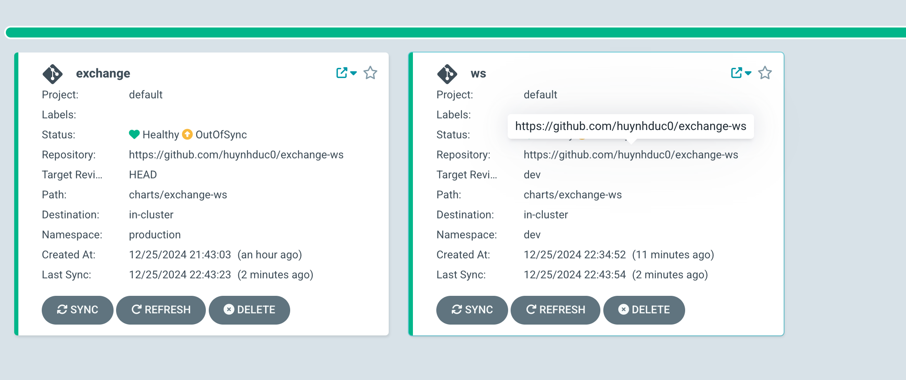
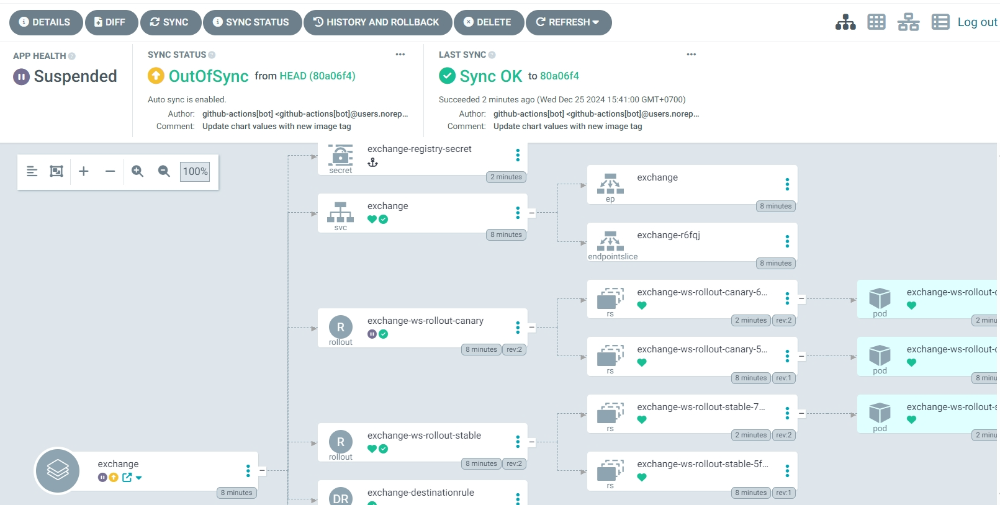
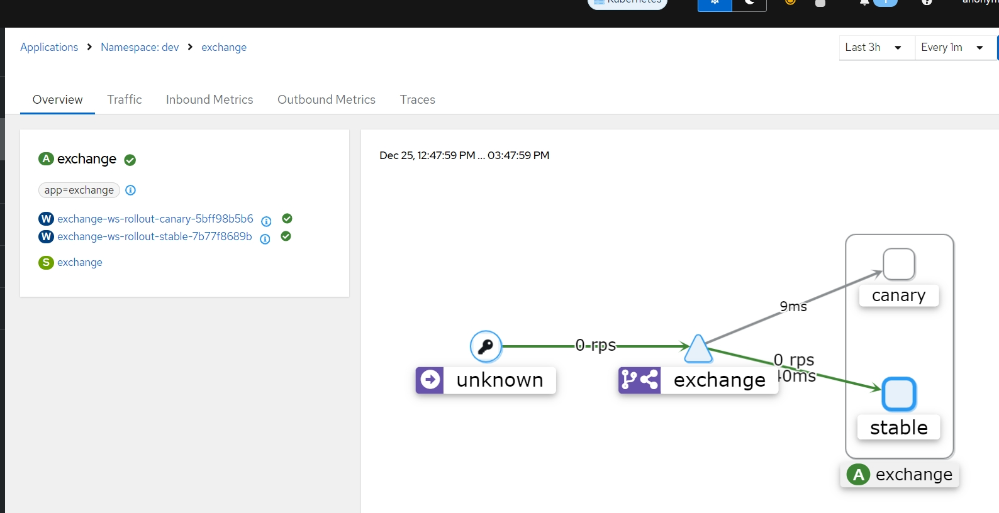
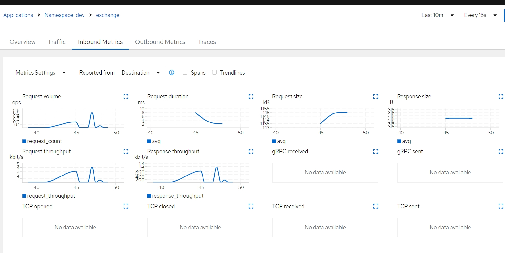
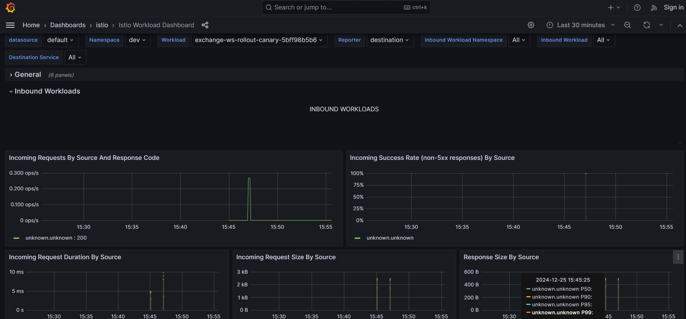

# Exchange Web Service

This repository contains the source code for the Exchange Web Service.

## Table of Contents
- [Quick Look](#quick-look)
- [Setup On Local](#setup)
- [Usage](#usage)
- [CI/CD Workflow](#cicd-workflow)
- [Testing](#testing)
- [Deployment Strategy](#deployment-strategy)
- [Monitoring](#monitoring)
- [Contributing](#contributing)
- [License](#license)


## Quick Look
The service is deployed and accessible at [exchange.itmosvn.me](http://exchange.itmosvn.me).
you can run test with command:
dev
 ```sh
    wscat -c "ws://exchange.itmosvn.me/ws?exchange=Binance&pair=BTC/USDT"
```
```sh
    wscat -c "ws://exchange.itmosvn.me:3000/ws?exchange=Bybit&pair=BTC/USDT"
```
prod:
 ```sh
    wscat -c "ws://wsprod.itmosvn.me/ws?exchange=Binance&pair=BTC/USDT"
```
```sh
    wscat -c "ws://wsprod.itmosvn.me:3000/ws?exchange=Bybit&pair=BTC/USDT"
```
 
## Setup

To set up the project locally, follow these steps:

1. Clone the repository:
    ```sh
    git clone https://github.com/huynhduc0/exchange-ws.git
    cd exchange-ws
    ```

2. Install dependencies:
    ```sh
    npm install
    ```

3. Create a `.env` file and add the necessary environment variables.

4. Start the development server:
    ```sh
    npm run dev
    ```

## Usage

To build and push the Docker image, push changes to the `dev` branch. The GitHub Actions workflow will handle the build and push process.

## CI/CD Workflow

The CI/CD pipeline is defined in the `.github/workflows/build.yaml` file. It includes the following jobs:

1. **Checkout**: Checks out the code from the repository.
2. **Setup**: Sets up Docker Buildx and logs in to Docker Hub.
3. **Extract Version**: Extracts the version from `package.json` and gets the short SHA of the commit.
4. **Build and Push**: Builds and pushes the Docker image to Docker Hub.
5. **Update Chart**: Updates the Helm chart values with the new image tag.
6. **Create Tag**: Creates a tag to trigger ArgoCD, will trigger prod.


### Argo CD Applications

We have two Argo CD applications:

- **Dev Environment**: Accessible at [exchange.itmosvn.me](http://exchange.itmosvn.me). When changes are pushed to the `dev` branch, Argo CD listens for the build and deploys to the dev environment.
- **Prod Environment**: Accessible at [wsprod.itmosvn.me](http://wsprod.itmosvn.me). When changes are pushed to the `main` branch, a tag is created, and Argo CD triggers the deployment to the prod environment based on the new tag.

### Environment Variables

The following environment variables are used in the workflow:

- `DOCKER_SERVER`: The Docker server (e.g., `docker.io`).
- `DOCKER_REGISTRY`: The Docker registry (e.g., `vanlahuynhduc`).
- `DOCKER_IMAGE_NAME`: The name of the Docker image (e.g., `exchange-ws`).

### Secrets

The following secrets are required for the workflow:

- `DOCKER_USERNAME`: Docker Hub username.
- `DOCKER_PASSWORD`: Docker Hub password.
- `GITHUB_TOKEN`: GitHub token for pushing changes and creating tags.

## Testing

To test the WebSocket service using `wscat`, follow these steps:

1. Install `wscat` globally:
    ```sh
    npm install -g wscat
    ```

2. Connect to the WebSocket server:
    ```sh
    wscat -c "ws://localhost:3000/ws?exchange=Binance&pair=BTC/USDT"
    ```
    ```sh
    wscat -c "ws://localhost:3000/ws?exchange=Bybit&pair=BTC/USDT"
    ```
3. Observe the response from the server.


## Deployment Strategy

I use Helm for managing deployments. The deployment strategy includes canary releases to ensure smooth rollouts.

### Canary Deployment

The canary deployment is defined in the Helm charts located in the `charts/exchange-ws/templates` directory. The `rollout-canary.yaml` and `rollout-stable.yaml` files define the canary and stable rollout configurations, respectively.

### Rollout with ArgoCD and Istio

ArgoCD is used for continuous delivery and deployment of the application. It monitors the Git repository for changes and automatically applies them to the Kubernetes cluster.


Traffic distribue:


Istio is used for traffic management and observability. It allows us to control the traffic flow between services and provides insights into the service performance.


The rollout strategy is defined using Argo Rollouts, which integrates with Istio to manage traffic splitting between different versions of the application. The rollout process is automated with Istio, ensuring smooth and controlled traffic shifts.



#### Steps for Rollout

1. **Initial Deployment**: The stable version of the application is deployed using the `rollout-stable.yaml` configuration.
2. **Canary Deployment**: A new version is deployed as a canary using the `rollout-canary.yaml` configuration. Traffic is gradually shifted to the canary version based on the defined steps.
### Monitoring
3. **Monitoring and Grafana Dashboard**: The performance and health of the canary version are monitored using Grafana and Istio metrics.


4. **Promotion**: If the canary version performs well, it is promoted to stable by updating the Helm values and redeploying.



## Contributing

Contributions are welcome! Please open an issue or submit a pull request.

## License

This project is licensed under the MIT License.